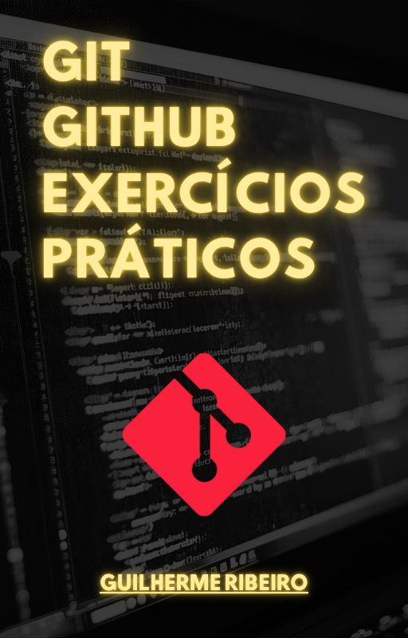
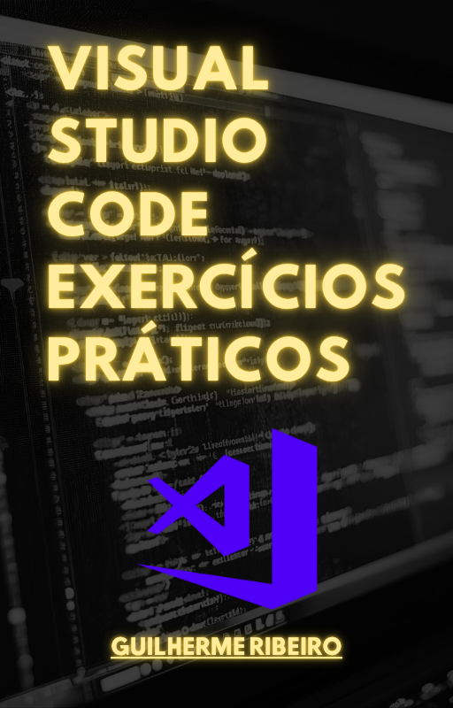

# EBOOKS 

  
 
 

Este ebook sobre Git e GitHub em 2025 traz uma visão completa e atual do controle de versão e da colaboração em projetos de software. Ele cobre fundamentos essenciais como commits, branches e merges, além de fluxos modernos de trabalho. Também apresenta os recursos mais recentes do GitHub, incluindo melhorias de colaboração e automação. É um material ideal para iniciantes e para quem busca dominar as práticas atualizadas do ecossistema.

- PREÇO: 49,00 REAIS
- Formatos EPUB/PDF
- Atendimento direto/Envio imediato
- E-mail: topverbs@gmail.com

---

    

O Visual Studio Code 2025 é o foco deste ebook, oferecendo uma introdução prática e atualizada ao editor mais utilizado por estudantes e desenvolvedores. O conteúdo apresenta instalação, configuração inicial, produtividade com extensões e personalização do ambiente. Também aborda integração com Git, atalhos modernos, recursos recentes e melhorias. É um guia direto para quem deseja estudar, organizar projetos e otimizar seu fluxo de trabalho no VS Code.

- PREÇO: 49,00 REAIS
- Formatos EPUB/PDF
- Atendimento direto/Envio imediato
- E-mail: topverbs@gmail.com

---

# CONTATO

- [linkedin.com/in/devgbr](https://www.linkedin.com/in/devgbr)    
- [github.com/devgbr86](https://github.com/devgbr86)

---

## Sobre

Meu nome é **Guilherme Ribeiro**, Programador e Desenvolvedor com experiência em **JavaScript, Node.js, Marked.js, TailwindCSS, Java, Flutter, além de versionamento utilizando Git.**    

Experiência na produção e edição de eBooks usando Markdown e Pandoc, garantindo padronização, qualidade tipográfica e conversões consistentes entre formatos.

Para este Portifólio utilizei uma Stack Front-end para site estáticos profissionais, baseada em:
- Marked.js
- Highlight.js
- TailwindCSS
- DOMPurify

---

  

